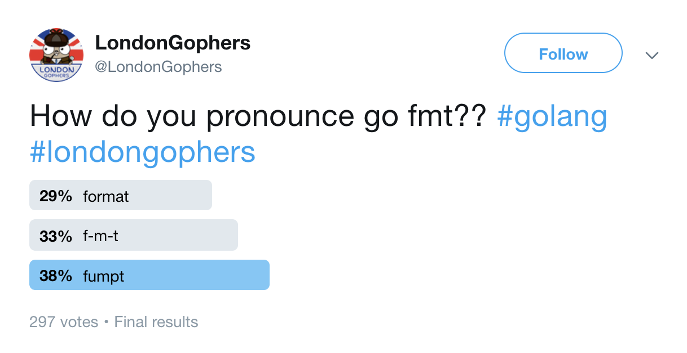

# Hello World Anatomy

any_name.go
```go
package main

import "fmt"

func main() {
        fmt.Println("gophers")
}
```

Create this file anywhere, and run `go run any_name.go`

Let's break this file down:

`any_name.go`
  - file names are generally snake_case
  - file names do not matter to the go compiler

`package main`
  - every file in go belongs to a package
  - "main" tells the Go compiler that the package should compile as an executable program instead of a shared library

`import "fmt"`
  - fmt is a package in the stdlib
  - package names are lowercase, and have no underscores
  - packages help group data and logic together

`func main() {`
  - the "main" function is the entrypoint into the executable. Go will start here

`fmt.Println("gophers")`
  - `Println` is a function in the `fmt` package
  - `Println` is capitalized: it is _exported_ from fmt (instead of being an internal function) // TODO: move this
  - Here is an [example](https://github.com/golang/go/blob/master/src/fmt/print.go#L77) of something that is unexported - lowercase! // TODO: this too
  - the `Println` function from the fmt package is being used to print "gophers".
  - go uses tabs, not spaces

`}`
  - this is the end of the main function
  - when we hit this, our program exits

## Exercises

To compile this, run `go build any_name.go`

To run the executable, run `./any_name`

To run without creating an executable, run `go run any_name.go`


## Tips

Go has great documentation: Try `go doc fmt` and `go doc fmt Println`, or see it [online](https://golang.org/pkg/).



## Further Reading

`go help build`

`go help run`

---

[prev](1.1.md) -- [next](1.3.0.md)